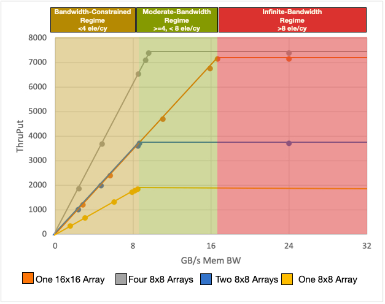

# ProSE Tapeout

This work is the implementation of _ProSE: the architecture and design of a protein discovery engine_ [[ASPLOS '22]](https://dl.acm.org/doi/pdf/10.1145/3503222.3507722?casa_token=AaaaUhe5T24AAAAA:mbtrAIdZRIy1PcjeEgdtGXarFZ29ODWcVOj2iyeQ2JA1WP7y4dMR40AFGfMu6DJg0e1g1pcGNAcFVQ). 
When we decided to tape out this accelerator, Protein discovery via BERT models was no longer the primary goal. Instead, with the recent introduction
of LLMs, which shared the dependence on long context lengths with [ProteinBERT](https://github.com/nadavbra/protein_bert),
we decided to retarget the ProSE architecture towards LLMs. ProSE is all about maintaining high utilization
of systolic arrays under memory bandwidth limitations so we thought it would be a good fit.

### High-Level Idea

[Roofline models](https://en.wikipedia.org/wiki/Roofline_model) are a way of modeling bottlenecks in throughput-oriented
systems and showing this "regime" change between memory bound and computationally bound programs. Theoretically then,
given the Bytes-per-OP for a program, we can know roughly how it will behave on the architecture. For the case of
output stationary systolic arrays, consider steady state: where activation inputs (A in an A x B matrix multiply) are
fully buffered and we are just streaming in weights (B). The maximum rate that a systolic array in such a circumstance
can consume is `S x w` bits per cycle for w-bit operands and a S x S systolic array. So then now we have a pretty
good estimate of where this regime change is.

What happens when we make our systolic array bigger (2X in each dimension)?
1. Each operand read from memory is re-used 2X 
2. Maximum flops/cy increased by 4X
3. The required steady-state memory bandwidth doubles.
4. The area of the array is 4X
5. Fill and Drain penalties increased by 2X

This is great - by increasing our computational bandwidth by 4X, we're also getting more efficient compute by reading
less from memory. This is why we see current systolic array architectures feature so few systolic arrays.

Unfortunately, we might not always have twice the memory bandwidth to afford this. What's more, with
certain network structures (ex. multi-head attention), fill and drain penalties become significant overheads.
This is also why we see systolic array architectures (ex. TPU) excel at CNNs but lag behind GPUs when it comes
to attention-based networks.

ProSE proposes the use of a series of lock-step, smaller systolic arrays with the following repercussions.
1. Weights are broadcasted to each systolic array, increasing memory re-use even for smaller arrays.
2. Using a series of smaller arrays reduces fill and drain penalties.
3. For the same number of compute units, this arrangement uses 2X as much SRAM for buffering but requires
    only half the memory bandwidth.

Regarding point 3, this may seem to be a problem, but we think it's a pretty decent tradeoff: SRAM is
extremely dense and off-chip memory bandwidth is expensive and, itself, requires significant area for
controllers. We present these results in a roofline plot collected from simulation using [DRAMsim3](https://github.com/umd-memsys/DRAMsim3)
for off-chip memory modeling.

